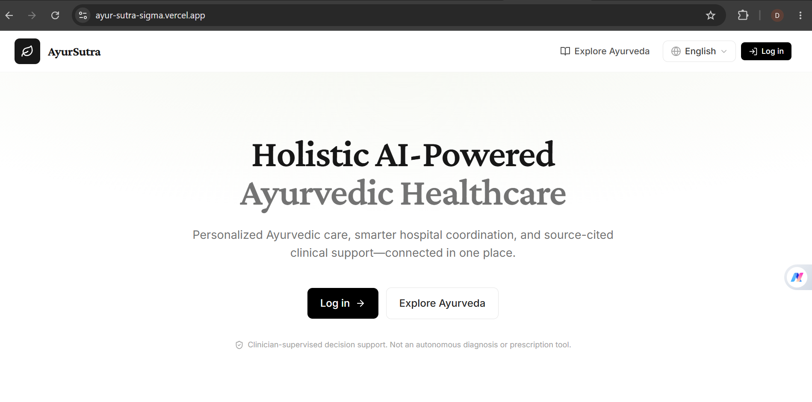
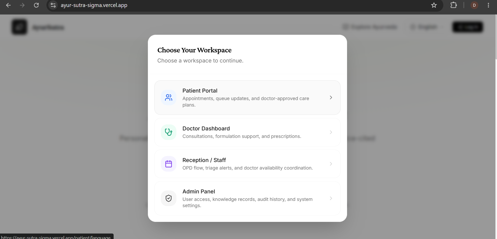
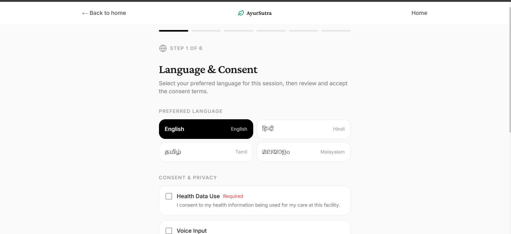
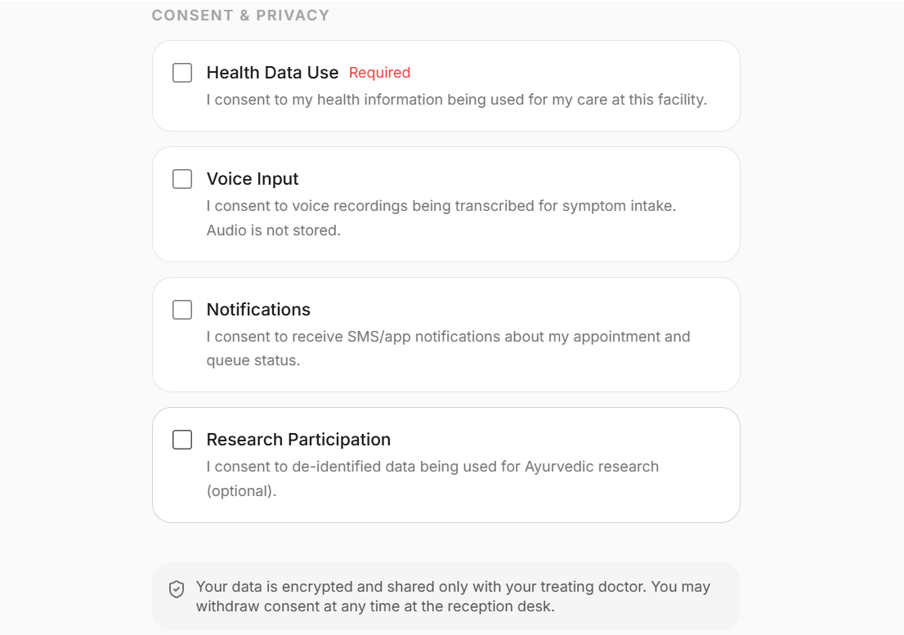
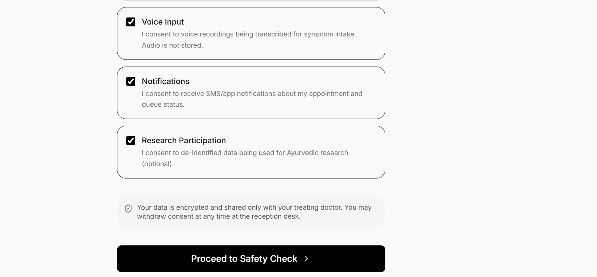
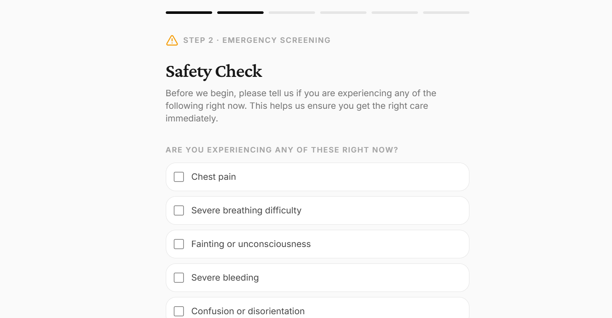
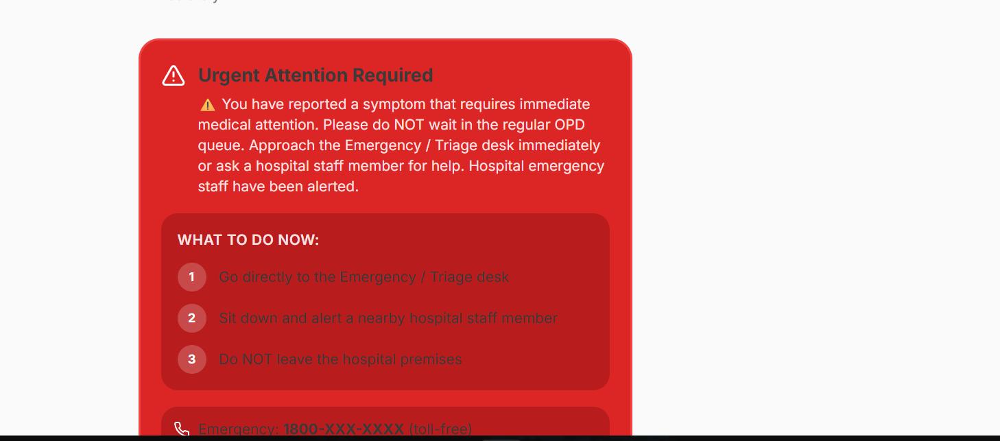
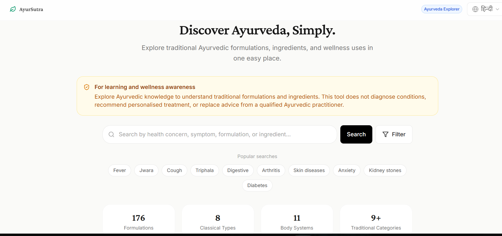
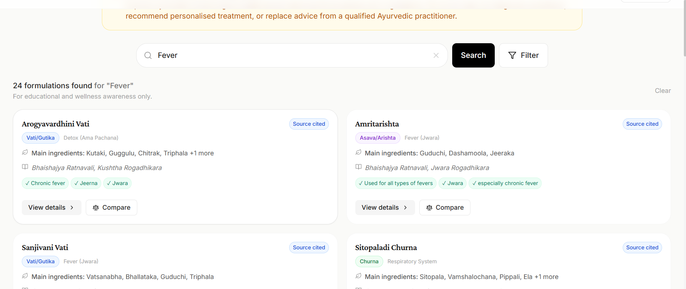

# AyurSutra

Ayurvedic Healthcare Application.

## Live Demo
🔗 https://ayur-sutra-sigma.vercel.app

## Run locally

```bash
git clone <repository-url>
cd AyurSutra
npm install
npm run dev
```

Open the localhost URL displayed in your terminal (usually `http://localhost:3000` or `http://localhost:3001`).

Windows users can double-click `start-project.bat` to start the application automatically.

## Get latest changes

When updates are pushed to the repository, pull them down and run:

```bash
git pull
npm install
npm run dev
```

## Screenshots

### Home Page


### Choose Your Workspace


### Patient Intake — Language & Consent





### Emergency / Safety Alert


### Explore Ayurveda


### Search
